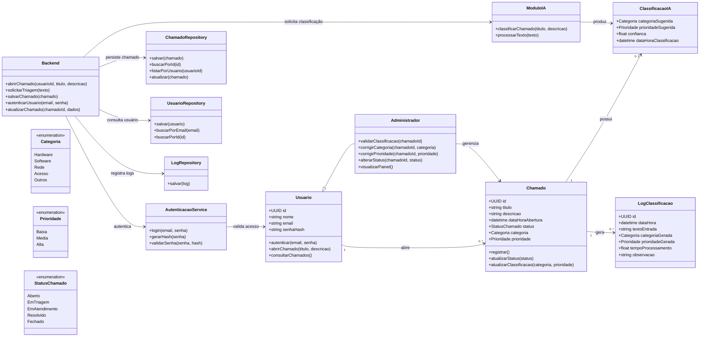
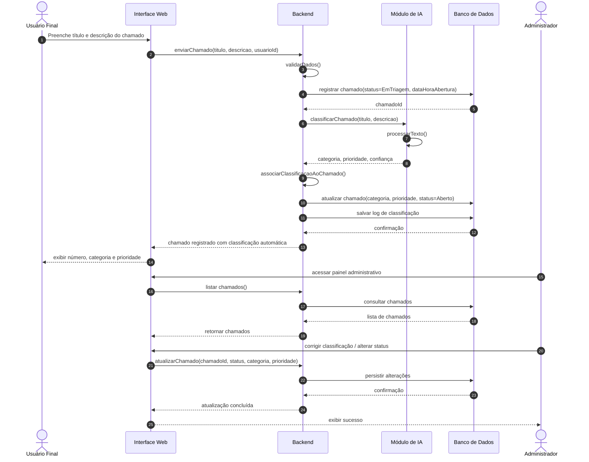
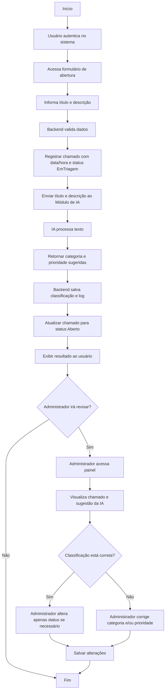
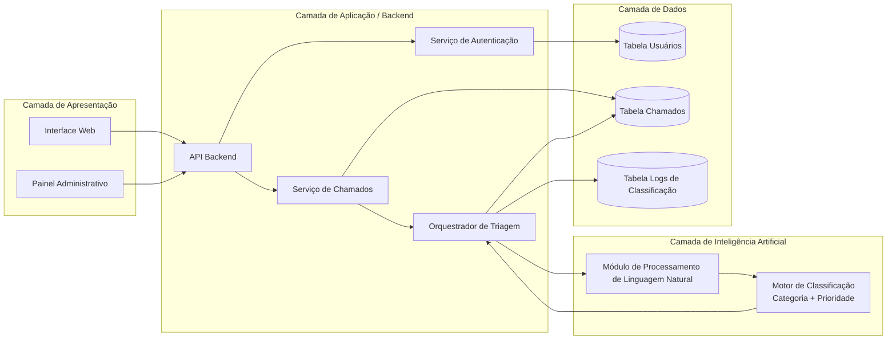

# CallsTrend

Sistema acadêmico de Help Desk com triagem automática de chamados por IA.

## 1. Entendimento consolidado do projeto

### 1.1 Objetivo do produto

O projeto tem como foco reduzir a triagem manual inicial de chamados técnicos. A ideia central é permitir que o usuário abra um chamado com texto livre e que o sistema atribua automaticamente:

- uma **categoria**;
- uma **prioridade**;
- um **status inicial coerente com o fluxo**.

O administrador continua responsável pela governança do atendimento, podendo revisar, corrigir e evoluir o chamado ao longo do processo.

### 1.2 Escopo funcional

Os requisitos funcionais descritos no material original levam a um fluxo principal bem definido:

1. abertura de chamado com título e descrição;
3. classificação automática por categoria;
4. classificação automática por prioridade;
5. consulta do status do chamado;
6. gestão administrativa dos chamados;
7. atualização do status de atendimento.

### 1.3 Arquitetura pretendida

O material modela a solução em **4 camadas**:

1. **Apresentação**: interface web do usuário e painel administrativo;
2. **Aplicação / Backend**: autenticação, regras de negócio, orquestração dos chamados;
3. **Inteligência Artificial**: módulo isolado responsável pela classificação textual;
4. **Dados**: persistência de usuários, chamados e logs.

Essa arquitetura favorece evolução incremental e está alinhada com uma implementação baseada em **SOLID**, principalmente por permitir:

- separar responsabilidades;
- isolar contratos entre camadas;
- trocar a implementação da triagem sem reescrever o domínio;
- manter baixo acoplamento entre API, regras de negócio e infraestrutura.
- 
---

## 2. Geral

- backend em **FastAPI**;
- arquitetura em camadas com foco em **SOLID**;
- domínio de chamados separado da infraestrutura;
- serviço de classificação;
- endpoints para criar, listar e atualizar chamados;
- testes automatizados do fluxo principal.

### Decisões

- a triagem é **heurística**, para acelerar a prova de conceito;
- a persistência está **em memória**, para reduzir complexidade inicial;
- autenticação completa foi deixada para a próxima fase;
- a API foi priorizada antes do frontend, porque ela representa o núcleo do sistema.
- 

---

## API — Documentação dos Endpoints

### Swagger interativo

Com a API em execução, acesse a documentação interativa nos endereços abaixo:

| Interface | URL |
|---|---|
| **Swagger UI** (recomendado) | `http://localhost:8000/docs` |
| **ReDoc** | `http://localhost:8000/redoc` |
| **OpenAPI JSON** | `http://localhost:8000/openapi.json` |

Arquivo separado (somente API): `src/callstrend/api/doc/swagger.md`

---

### GET /health

Verifica se a API está no ar.

**Autenticação:** não necessária

**Response 200 — OK**
```json
{
  "status": "ok"
}
```

---

#### Fluxo interno

1. O chamado é registrado com status `EmTriagem`.
2. O módulo de IA analisa título e descrição via palavras-chave ponderadas.
3. O chamado é atualizado para `Aberto` com categoria e prioridade inferidas.
4. A resposta retorna o chamado classificado.

#### Request body

```json
{
  "title": "VPN sem conectar",
  "description": "Não consigo acessar o sistema interno pela VPN desde a manhã.",
  "requester_name": "Maria Silva",
  "requester_email": "maria@empresa.com"
}
```

| Campo | Tipo | Obrigatório | Regras |
|---|---|---|---|
| `title` | `string` | Sim | 3–120 caracteres |
| `description` | `string` | Sim | 10–2000 caracteres |
| `requester_name` | `string` | Sim | 3–80 caracteres |
| `requester_email` | `string` | Sim | 5–160 caracteres |

#### Response 201 — Created

```json
{
  "id": "3fa85f64-5717-4562-b3fc-2c963f66afa6",
  "title": "VPN sem conectar",
  "description": "Não consigo acessar o sistema interno pela VPN desde a manhã.",
  "requester_name": "Maria Silva",
  "requester_email": "maria@empresa.com",
  "created_at": "2026-05-12T21:00:00Z",
  "status": "Aberto",
  "category": "Rede",
  "priority": "Alta",
  "classification_confidence": 0.83,
  "classification_rationale": "Categoria sugerida: Rede (score 2). Prioridade sugerida: Alta (score 2)."
}
```

| Campo | Tipo | Descrição |
|---|---|---|
| `id` | `string` (UUID v4) | Identificador único do chamado |
| `title` | `string` | Título informado |
| `description` | `string` | Descrição informada |
| `requester_name` | `string` | Nome do solicitante |
| `requester_email` | `string` | E-mail do solicitante |
| `created_at` | `datetime` (ISO 8601 UTC) | Data/hora de abertura |
| `status` | `string` (enum) | Status atual do chamado |
| `category` | `string` (enum) | Categoria atribuída pela IA |
| `priority` | `string` (enum) | Prioridade atribuída pela IA |
| `classification_confidence` | `float` (0.0–1.0) | Nível de confiança da classificação |
| `classification_rationale` | `string` | Justificativa textual da IA |

#### Outros códigos

| Código | Situação |
|---|---|
| `422 Unprocessable Entity` | Campos inválidos ou ausentes |

---

### GET /api/v1/tickets

Retorna todos os chamados registrados com sua classificação atual.

#### Response 200 — OK

Array de objetos `TicketResponse` (mesma estrutura do `POST`).

```json
[
  {
    "id": "3fa85f64-5717-4562-b3fc-2c963f66afa6",
    "title": "VPN sem conectar",
    "description": "Não consigo acessar o sistema interno pela VPN desde a manhã.",
    "requester_name": "Maria Silva",
    "requester_email": "maria@empresa.com",
    "created_at": "2026-05-12T21:00:00Z",
    "status": "Aberto",
    "category": "Rede",
    "priority": "Alta",
    "classification_confidence": 0.83,
    "classification_rationale": "Categoria sugerida: Rede (score 2). Prioridade sugerida: Alta (score 2)."
  }
]
```

Quando não há chamados: retorna `[]`.

---

### PATCH /api/v1/tickets/{ticket_id}

Atualiza um chamado existente — uso administrativo.

#### Path parameter

| Parâmetro | Tipo | Descrição |
|---|---|---|
| `ticket_id` | `string` (UUID) | ID do chamado a ser atualizado |

#### Request body

Todos os campos são **opcionais**. Apenas os campos enviados serão alterados.

```json
{
  "status": "EmAtendimento",
  "category": "Rede",
  "priority": "Alta"
}
```

| Campo | Tipo | Obrigatório | Valores aceitos |
|---|---|---|---|
| `status` | `string` (enum) | Não | `EmTriagem`, `Aberto`, `EmAtendimento`, `Resolvido`, `Fechado` |
| `category` | `string` (enum) | Não | `Hardware`, `Software`, `Rede`, `Acesso`, `Outros` |
| `priority` | `string` (enum) | Não | `Baixa`, `Media`, `Alta` |

#### Response 200 — OK

Objeto `TicketResponse` com os dados atualizados.

#### Outros códigos

| Código | Situação |
|---|---|
| `404 Not Found` | `ticket_id` não encontrado |
| `422 Unprocessable Entity` | Valor de enum inválido |

---

### Exemplos com curl

**Abrir chamado:**
```bash
curl -X POST http://localhost:8000/api/v1/tickets \
  -H "Content-Type: application/json" \
  -d '{
    "title": "Impressora não imprime",
    "description": "A impressora do setor financeiro parou de funcionar após atualização do driver.",
    "requester_name": "Carlos Mendes",
    "requester_email": "carlos@empresa.com"
  }'
```

**Listar chamados:**
```bash
curl http://localhost:8000/api/v1/tickets
```

**Atualizar status e corrigir prioridade:**
```bash
curl -X PATCH http://localhost:8000/api/v1/tickets/{ticket_id} \
  -H "Content-Type: application/json" \
  -d '{"status": "EmAtendimento", "priority": "Alta"}'
```

---

## 3. Base conceitual do projeto

- TAP;
- cronograma inicial;
- declaração de escopo;
- EAP/WBS;
- requisitos funcionais e não funcionais;
- diagramas do sistema;
- protótipo funcional;
- módulo de triagem automática com IA;
- relatório de testes;
- documentação final.

## 3.2 Requisitos funcionais de referência

- **RF01** – cadastro e autenticação;
- **RF02** – abertura de chamados com descrição textual;
- **RF03** – classificação automática por categoria;
- **RF04** – classificação automática por prioridade;
- **RF05** – acompanhamento do status;
- **RF06** – gestão administrativa;
- **RF07** – atualização do status do chamado.

## 3.3 Requisitos não funcionais de referência

- interface simples e intuitiva;
- resposta adequada da triagem;
- uso de tecnologias open-source;
- acesso via navegador;
- organização do código e versionamento.

## 3.4 Critérios de aceitação de referência

- as funcionalidades do fluxo principal devem estar implementadas;
- a triagem automática precisa ser demonstrável;
- categoria e prioridade devem ser visíveis;
- o sistema deve funcionar localmente;
- a documentação deve estar organizada.

---

## 4. Diagramas

## 4.1 Diagrama de Classes



## 4.2 Diagrama de Sequência



## 4.3 Diagrama de Atividades



## 4.4 Diagrama de Componentes


